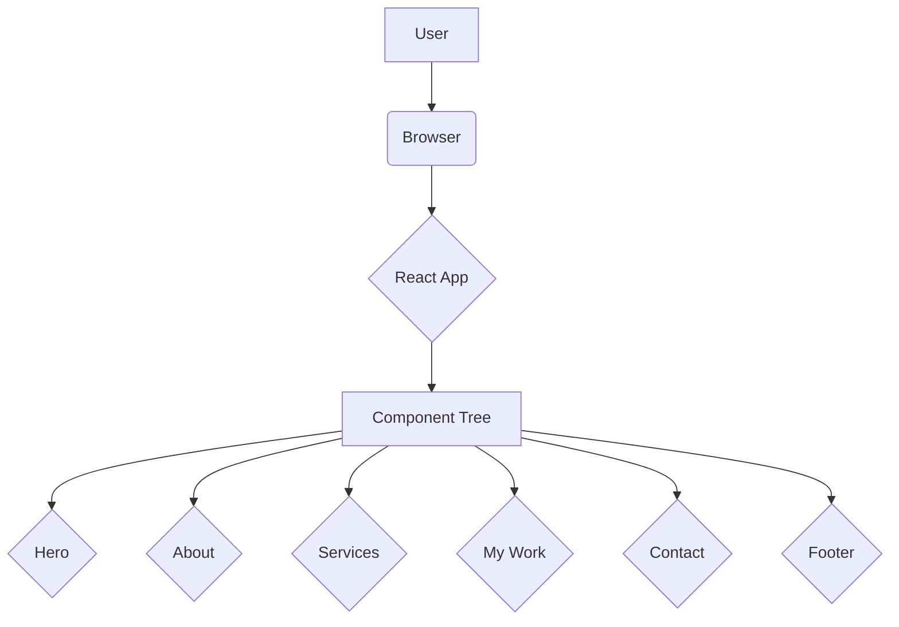

# System Patterns

## 1. System Architecture

The portfolio is a single-page application (SPA) built with React. The architecture is client-side rendered, with Vite serving as the build tool and development server.



## 2. Design Patterns

- **Component-Based Architecture:** The UI is broken down into reusable and self-contained components. Each component manages its own state and logic, promoting separation of concerns and reusability.
- **State Management:** For now, component-level state is managed using React Hooks (`useState`, `useEffect`). If the application grows in complexity, a global state management library like Redux or Zustand might be considered.
- **CSS Modules/Styled-Components:** CSS is scoped to individual components to avoid style conflicts. This is achieved by using separate CSS files for each component.

## 3. Component Structure

The components are organized by feature, with each component having its own directory containing the JSX file and its corresponding CSS file.

```
src/
|-- Components/
|   |-- About/
|   |   |-- About.jsx
|   |   |-- About.css
|   |-- Contact/
|   |   |-- Contact.jsx
|   |   |-- Contact.css
|   |-- ... (other components)
```
